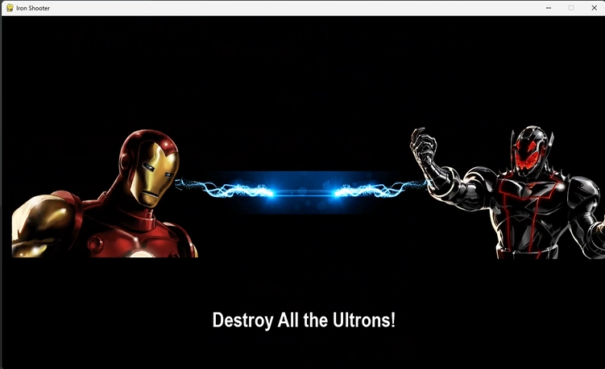
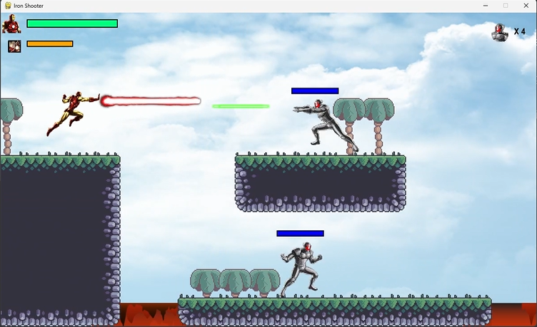
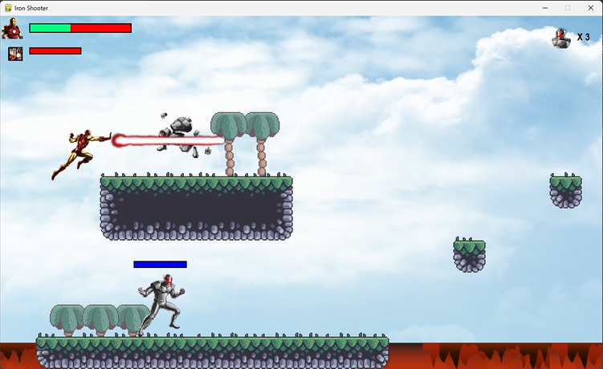
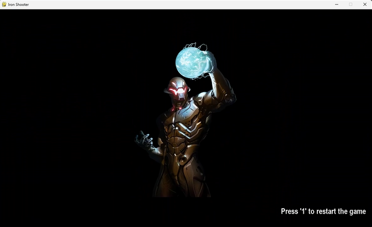

# iron_shooter
After making my first pygame, Peter Piu Piu Pygame, I wanted to practice more pygame, so I made this iron shooter. 
This game is a side scrolling shooting game. It is similar to the traditional Mario but with shooting added. 
I am a huge Marvel fan. Therefore, I used Iron Man as the main character that player controls and Ultrons as the antagonists. 

----------------------------------------------
### Game Components
Iron Man: Main character controlled by the player. Iron Man can destroy Ultrons by shooting laser. 
Iron Man loses health if hit by Ultron's green laser or if he touches lava. 

Iron Man's Energy: Iron Man's energy bar decreases in flight and recharges when he lands on ground.

Ultron: 4 Ultrons in the game. Ultrons shoot laser if Iron Man appears in their vision.

Game ends if all Ultrons are destroyed or Iron Man's health drops to zero.

-----------------------------------------------
### Game Controls
Iron Man:
- 'A' moves Iron Man left
- 'D' moves Iron Man right
- 'W' for flight
- Space to shoot laser 

Restart Game:
- Once game is over and end animation finishes, press '1' to restart the game.

----------------------------------------------
### Code References
- YouTube: Coding with Russ (PyGame Scrolling Shooter Game Beginner Tutorial in Python)
- YouTube: Clear Code (Creating a Mario style level in Python / Pygame with a visual level editor [Tiled])
- Auburn University CPSC 4970 Python (Instructor: Dr. Shaffer)

----------------------------------------------
### Image References
- Iron Man and Ultron: Cyrus Annihilator (solid.cyrus@gmail.com)
- Terrains, Palms, and Grass: Clear Code (https://github.com/clear-code-projects/2D-Mario-style-platformer)
- Rest of images: downloaded from https://www.pngegg.com/ without authors

---------------------------------------------
### SetUp
Install pygame and run game.py and the game should run.

